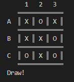

# TicTacShell


Compete against a computer in a Linux shell version of the TicTacToe game. This is an assignment for the subject Operating Systems.

<br/>
<div align="center">
  <p>
    
  </p>
</div>

## Running
This script can run in a Linux environment and Windows, after setting the environment to run shell scripts in the terminal.

To run the game use the following command in the terminal:

```
sh TicTacToe.sh
```
